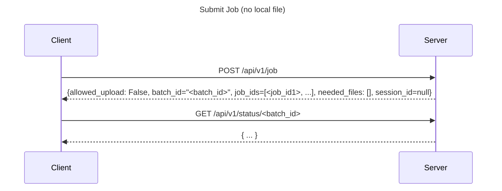
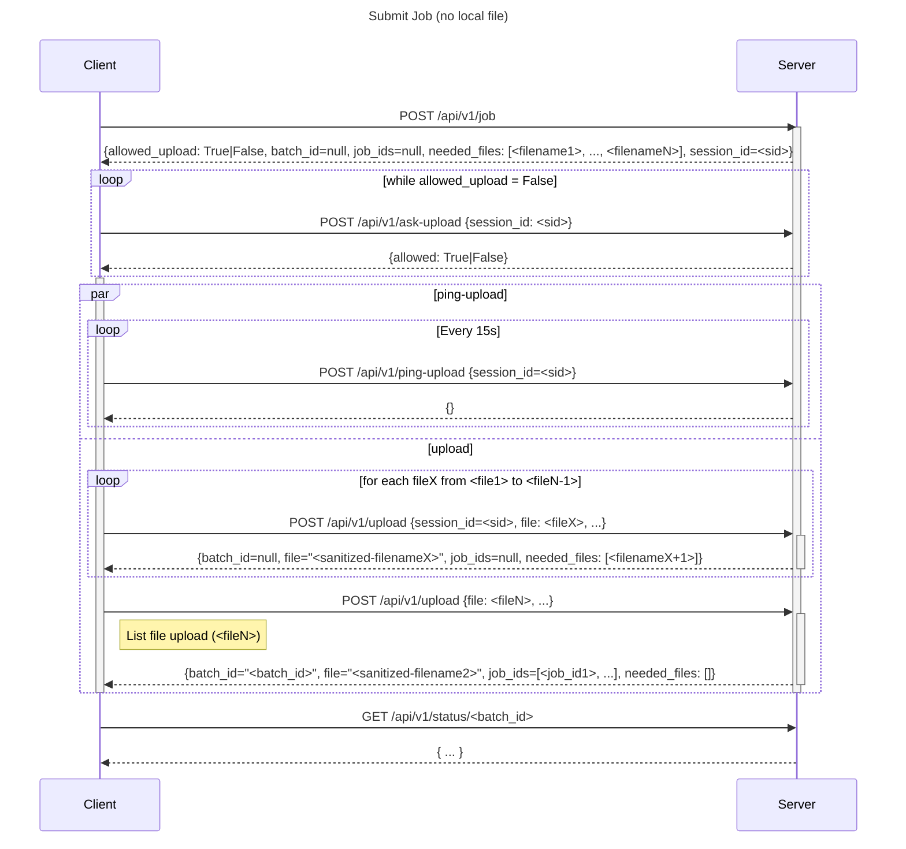

# API

## Get instance configuration

```
GET /api/v1/config
```

## Submit a job

First submit a job with a post request

```
POST /api/v1/job
```

- if `batch_id` is not null, then the job has been submitted and no files are needed to be uploaded
- else, files need to be uploaded (list is in the `needed_files` array:
  - if `allowed_upload: False`, client must use `POST /api/v1/ask-upload` with session_id each 15s until the answer contains `allowed: True`
  - when `allowed_upload: True` or `allowed: True`, client can use `POST /api/v1/upload`:
    - until the response contains a no null `batch_id`, files must be uploaded. List of remaining files is in `needed_files` array



- Job with local files to upload


